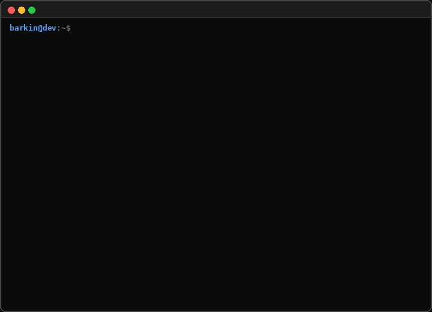

## Hi 👋, I'm Barkın Kocatepe

**Software Engineer | Cloud & Systems oriented**

---

### About Me

- Focused on DevOps, cloud-native infrastructure, and CI/CD automation
- Working across Azure, AWS, and GCP with Kubernetes, Docker, and Terraform

---

### Languages & Tools

   

---

### Connect

[LinkedIn — Barkin Kocatepe](https://www.linkedin.com/in/barkin-kocatepe-6a43922a2)

 

  

